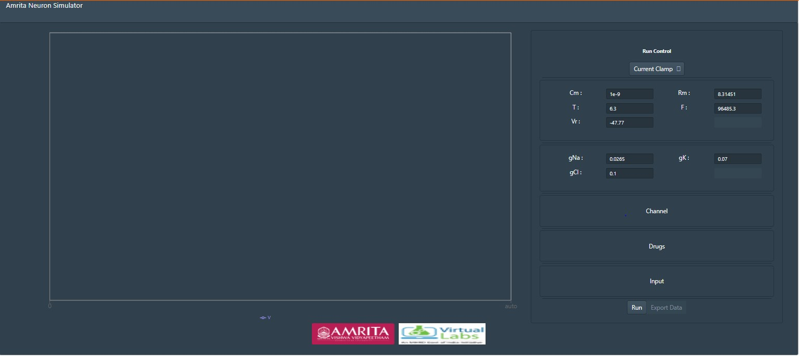
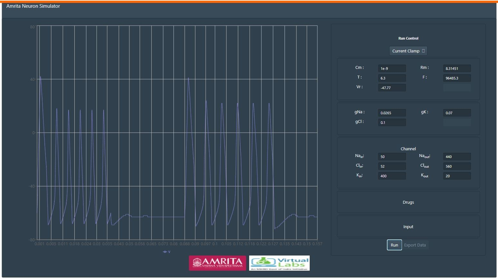
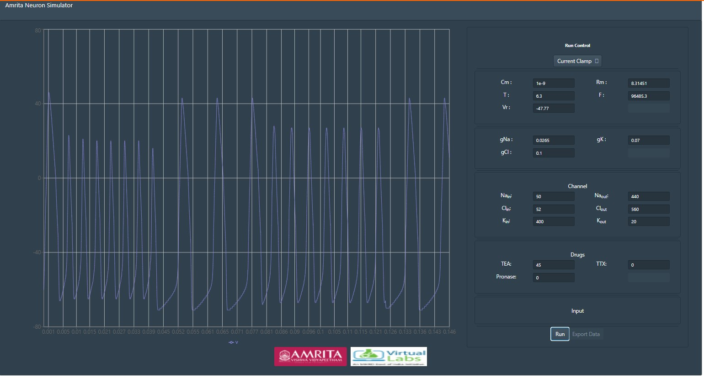
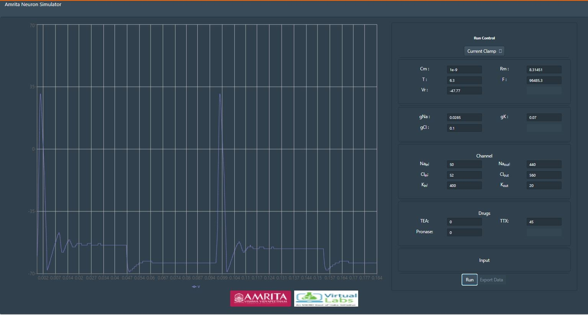
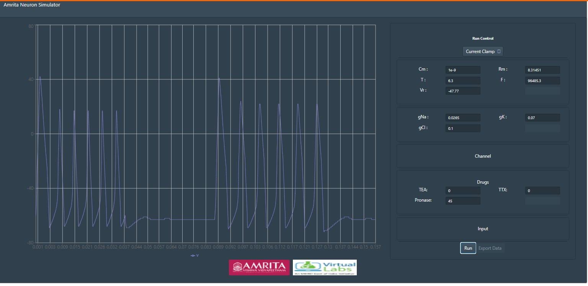
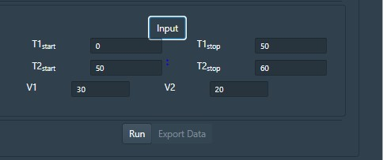

**Procedure to Work Simulator**
 

**Parameters in the simulator window**

Cm  = Membrane Capacitance

Rm  = Membrane resistance

Vr  = Resting Voltage

gNa = Conductance of Sodium ions

gK= Conductance of Potassium ions

gCl= Conductance of Chloride ions

T = Temperature

F= Frequency

&nbsp;

 Channel windows indicates parameters for each of the active or passive ion channel types. Passive channels conductance can be varied in the channel window. Voltage gated channels parameters can be accessed by clicking on channel details. 

&nbsp;

**--** Users have to always chose Current Clamp mode to complete the experiment protocol.

&nbsp;

&nbsp;

**--** Default values for each parameters are provided in the simulator window. Click “Run” to execute simulation.

&nbsp;

&nbsp;

 
With varying parameters, users can observe and learn the pattern differences with applied current and can also study the effect of capacitance and conductance properties of a nerve cell in action potential generation and propagation.This explains how action potential is initiated and propagated along the axon and the importance of passive membrane properties such as capacitance and conductance in the process of initiation and propagation of action potential.

&nbsp;

Drug window allows to study the pharmacological effect in neuronal membrane by the application of three drugs TTX (Tetrodotoxin - Inhibit Na current), TEX (Tetraethylammonium- Inhibit K current), Pronase (eliminate Na+ inactivation). At any point of time these drugs can be applied.

&nbsp;

**--** User can provide drug concentration values in the GUI and can Run the simulator window. Observe the change in action potential.

&nbsp;

&nbsp;
**--** First provide a particular TEA drug concentration  

Here, TEA act as a probe to alter the structural and functional properties of potassium channels. It binds to the ion conduction pathway and inhibit the potassium ion flow in the cell membrane. 

&nbsp;

**--** Next user can give specific value for the drug TTX and can observe the change in the generation of action potential.

&nbsp;

&nbsp;

**--** Provide specific value for Pronase to observe the change in the generation of action potential

&nbsp;

&nbsp;

Pronase selectively destroys inactivation of the Na conductance (g(Na)). Pronase reduces g(Na), by destroying some of the channels, but after removal of its inactivation gate Na channel seems no longer vulnerable to Pronase.

&nbsp;

Drug channels helps to study different response from a nerve cell such as action potential, excitatory and inhibitory post synaptic potentials and the effect of drugs.

&nbsp;

Users can provide drug concentration values and can observe and understand the effect of drugs in ion channels and spiking properties of neurons. 

&nbsp;

Input parameters represent Time (T1 and T2) and applied voltage (V1 and V2). Users can enter specific values for time to understand the nature of current clamps at that particular time window. 

