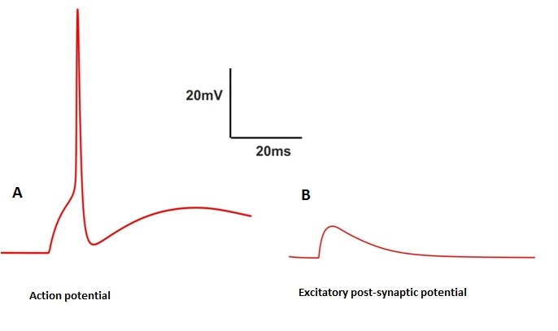
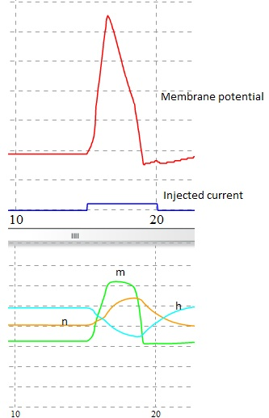
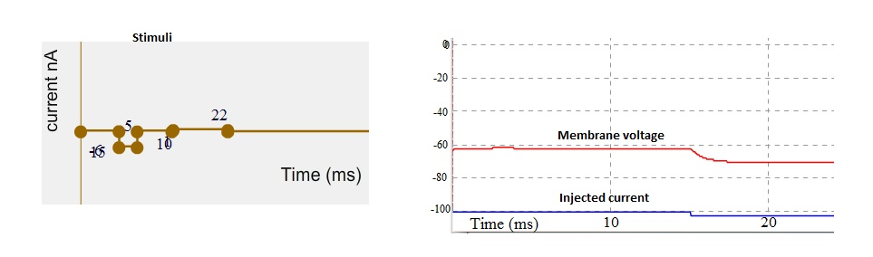
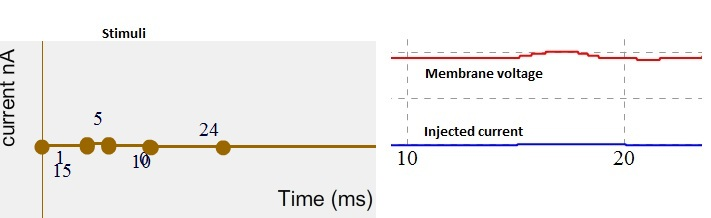

Electrically excitable cells (also called neurons) generates a series of voltage pulses in responses to different input as currents. These responses or electrical signals are also called action potentials or spikes which are usually originate near the soma and propagate through the axon with constant velocity and amplitude.

Intracellular recordings from neurons are measured using an micro electrode whose tip is about one micron diameter. When a microelectrode is inserted into a nerve cell as a response the polarity difference can be observed by a sharp change in the potential from 0 mV to -60 mV, the resting potential of the cell. The potential which is recorded when a living cell is at rest (not receiving any stimuli) is called resting potential. Usually it ranges from -80 mV to -40 mV depending upon the type of the nerve cell. In absence of any stimuli the membrane potential of the cell is generally constant. Current clamp intracellular recordings are mainly used to study action potential (see Fig. 1).
 
 
 
&nbsp;

 

Fig. 1. Components of an Action Potential (resting potential, threshold potential, depolarizing phase and hyperpolarizing phase).

 

 

Action potential is also referred as all or none event because the potential difference from outside the membrane to inside has to cross a particular threshold to turned into a event/spike. When an neurophysiologist inserting an electrode into the brain to observe this all or none event, is measured as an electrical potential across the membrane (V), usually the peak of this event ranges between +10 to +30 mV, the amplitude of  membrane potential is mainly depends on the temperature. Other forms of all or none event were also observed as complex spike in Purkinje cells and burst in pyramidal cells of the cortical. Only a small percentage of cells in the nervous system are not able to make spikes such as non-spiking cells , can be found in the distal retina (bipolar, horizontal and certain types of amacrine cells). Action potentials are dominant feature of nervous system as all or none events. This believes gives enough motivation for neural network models originated in 1930s (Rashevsky 1938,McCullough and Pitts 1943). 

 

Ionic mechanism underlying the initiation and propagation of action potential was studied in squid axon by a number of  eminent scientist specifically by Hodgkin and Huxley in cambridge, England (1952a,1952b,1952c and 1952d). Here we were implemented Hodgkin and Huxley model of squid axon to study current clamp technique.
 
  
&nbsp;

 

 Fig 2. Schematic representation of current clamp experimental setup (left). Cartoon representation of membrane voltage recording at soma, a bunch of spikes (also called burst) in response to current as input into the dendrites (right).

 

 

In current clamp techniques we will record membrane potential (as a response from a nerve cell) by injecting/applying current as input to the cell (Fig 2). Unlike in voltage clamp experiment voltage has to be hold to a level (set by the experimenter) but in current clamp experiment the membrane potential (V) is free to vary.

 

The ideal current clamp setup is consists of recording and stimulating electrodes, membrane potential amplifier ,feedback amplifier and a signal generator (see Fig 2 (left)). The measured voltage is amplified by an external amplifier usually called as current clamp amplifier.

 

Ohm's law (V = IR) can be applied here to obtain a simple relationship between the current injected (I), the voltage recorded (V), and the "input resistance" (R) of the membrane. If a drug or transmitter is then applied to the cell, a change in the size of the voltage response to the current pulse indicates a change in ionic conductance (g = 1/R). By incrementally varying the amplitudes of the current steps over a wide range (typically from 0.1 to 1 nA in mammalian CNS neurons), a family of voltage responses can be obtained for construction of a voltage-current (V-I) curve (where voltage is typically plotted as a function of injected current;. This curve reveals much about the "macroscopic" currents (that is, the aggregate currents flowing through many ionic channels) passing through the neuronal membrane at different membrane potentials. Any drug treatment that alters ionic conductance will also alter the slope and shape of the V-I curve. Thus, a reduction in the slope of the V-I curve indicates increased ionic conductance, whereas a steeper slope indicates decreased conductance.
 

 
**Generation of Action potential**

 

One of the greatest remarkable property of axonal membrane is its propensity to response to an input current as stimuli. If the amplitude of this current is low, the response may not cross the threshold then the response of the cell may lead into an EPSP (membrane will depolarize slightly then return to its resting potential) (Fig.2 B) . On the other hand a larger input signal induces an action potential (Fig.2 A).
 

 
 
&nbsp;

 
 

Fig 3. Action potential and EPSP as Spiking and non-spiking event

 

 

Consider a short 0.5 msec inward current pulse injected into the cell of 1 nA to the membrane. This current injection charges up the membrane and this process will start depolarize the membrane. Smaller this capacitance faster will be the potential rise. This increased depolarization has an effect on slight increase in the values of m, n by an effect on sodium and potassium activation (m,h,n are the HH state variable of channels sodium and potassium (see Fig. 4) (For more details see experiments 4 and 5) . And the response of the cell is turned into an EPSP(see Fig. 3 B). If the amplitude is increased again , the membrane will depolarize faster and more, the amount of INa generated exceeds the amount of IK. At this point the membrane depolarizes more and the value of m increases. This increase in opening states of Na+ channel increases membrane potential to its peak as we see in the figure 3  both the slower Na+ inactivation variable 'h' and potassium activation variable 'n' will turn on.

 

Rate of change of voltage dv/dt is given by:

  
&nbsp;

 

           (Eqn 1) 

 

m,h,n are the channel state variables. gNa and gK are the maximum conductance of sodium and potassium channels. ENa,EK and El are the reversal potential of sodium, potassium and leakage channels. V is the membrane voltage and I is the injected current as stimuli.

 

 
  
&nbsp;

 

 

 

Fig 4. Simulation of Action potential and its channel dynamics

 

 

Consider a case in which negative terminal of the battery to the stimulating electrode which is inserted into the cell in response to this stimuli the membrane potential become more negative/polarize (see Fig. 5). These changes in the potential that increase the polarized state of membrane is called hyperpolarization (see Fig. 5).

 

  
&nbsp;

 
 

Fig 5. Stimuli as current (left). Simulated membrane potential (red trace) and injected current indicated by blue trace. Note that membrane potential get hyperpolarize.

 

 

When an positive terminal of the battery connected to the stimulating electrode which is then inserted into the nerve cell in response to this stimuli the membrane potential become more positive / depolarize. Such changes in the membrane potential are called as depolarizations.

 

 
  
&nbsp;

 

Fig 6. Stimuli as current (left). Simulated membrane potential (red trace) and injected current indicated by blue trace. Note membrane potential started depolarize.
